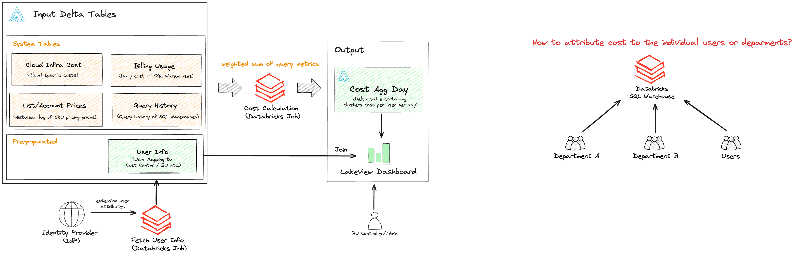
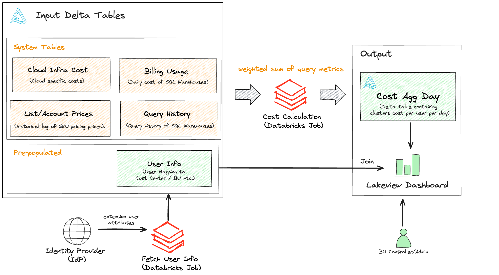

# Introduction

This project establish a solution to calculate costs of queries run by users on “shared” Databricks SQL Warehouses.
To accomplish this, system tables and numerous metrics provided by query history are used.

# Problem



# Solution



# Getting started

1. Install the Databricks CLI from https://docs.databricks.com/dev-tools/cli/databricks-cli.html

2. Authenticate to your Databricks workspace, if you have not done so already:
    ```
    $ databricks configure
    ```

3. Deploy a development copy of this project to the workspace:
    ```
    $ databricks bundle deploy --target dev
    ```
    This deploys everything that's defined for this project.
    Note that "dev" is the default target, so the `--target` parameter is optional here.

4. Similarly, if you want to deploy a production copy of this project to the workspace:
   ```
   $ databricks bundle deploy --target prod
   ```

5. Run the jobs:

   ```
   # deploy tables
   $ databricks bundle run create_tables_job --target dev
   
   # run the calculation
   $ databricks bundle run calculate_job --target dev
   
   # run job to fetch user info
   $ databricks bundle run fetch_user_info_job --target dev
   ```

6. Optionally, install developer tools such as the Databricks extension for Visual Studio Code from
   https://docs.databricks.com/dev-tools/vscode-ext.html. Or read the "getting started" documentation for
   **Databricks Connect** for instructions on running the included Python code from a different IDE.

7. For documentation on the Databricks asset bundles format used
   for this project, and for CI/CD configuration, see
   https://docs.databricks.com/dev-tools/bundles/index.html.

# Local Development

Follow the below steps to run the project on your local machine.

## Building the project: installing dependencies, formatting, linting, testing

```bash
make all
```

## Setting up IDE

### Installing project requirements

```bash
poetry install
```

### Updating project requirements

```bash
poetry update
```

### Get path to poetry virtual env so that you can setup interpreter in your IDE

```bash
echo $(poetry env info --path)/bin
```

Activate poetry virtual environment:

```bash
source $(poetry env info --path)/bin/activate
```

## Running individual tests

* Unit testing:

```
source $(poetry env info --path)/bin/activate
pytest tests/unit --cov
```

* Integration testing:
```
source $(poetry env info --path)/bin/activate
pytest tests/integration --cov
```

* End to End testing:
```
source $(poetry env info --path)/bin/activate
pytest tests/e2e --cov
```

## Reinstalling poetry virtual env

```
poetry env list
poetry env remove project-name-py3.10
poetry install
```

# Contribute

See contribution guidance [here](CONTRIBUTING.md)
